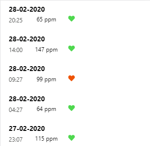

# rithmi

Esto es una prueba tecnica para Rithmi.
Consiste en mostrar un historial del ritmo cardiaco y a continuacion una grafica lineal sacada de los datos del historial.
Se ha realizado con React Native usando el cliente Expo.

## Requisitos

Es necesario tener NodeJS instalado.

## Instalacion

Necesitas seguir los siguientes pasos:

1. Abre la consola, dirigete a la carpeta de la prueba y ejecuta el comando "npm i" para instalar todas las dependencias.
2. Para arrancar la prueba ejecuta el comando "npm start". Se abrira una ventana en el navegador con varias opciones de visualizacion,
entre ellas poder ver la prueba en el navegador.

## Vista previa

## Autor

Carlos Alabau.
